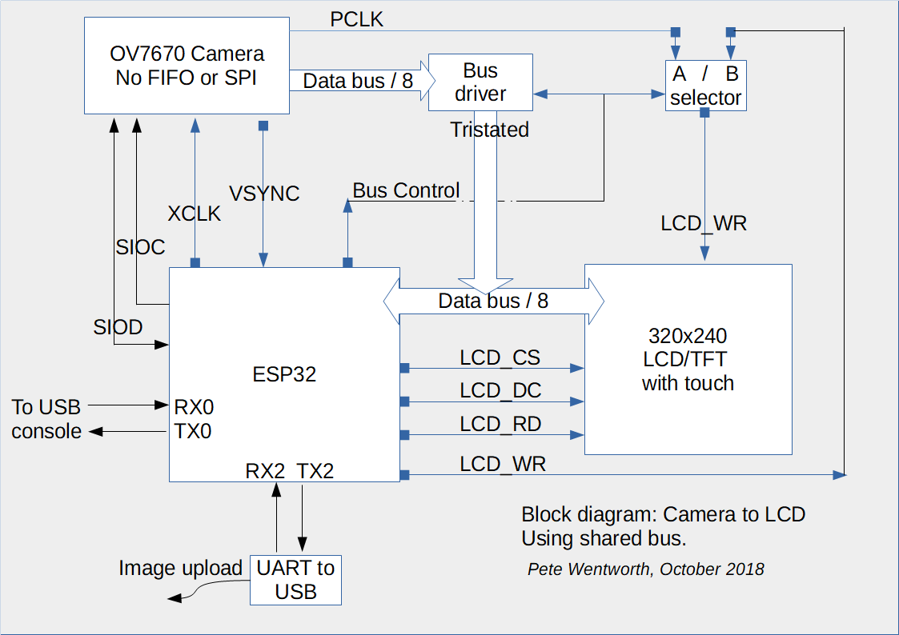

# ESP32_YetAnotherCamToLCD

Pete Wentworth  cspwcspw@gmail.com


The project uses an ESP32 processor to directly stream video at 
25 frames per second of RGB565 data from an OV7670 
camera to a 320x240 LCD screen which also has touch sensing.   

Like a cellphone, one can tap the screen to capture a snapshot.
This project uploads the snapshot to a host computer 
(but could be modified to save it in SPIFFS / onto a Micro SD card). 

There is a 2 minute video at https://youtu.be/3Ga8L9qx-Yk 

Some readers might have seen my previous project at
 https://github.com/cspwcspw/ESP32_CamToLCD. It might be necessary to 
 look at that writeup to get more background to what I cover here. 
 
 The key differences with this newer version are:

   * I do not bring the pixel data through the ESP32 at all.  So there is no use of I2S or Direct Memory Access.  I send the pixel data from the camera 
   directly to the LCD on a shared data bus.  
   * Previously I was unable to capture 320x240x2-byte frames due to memory limitations on the ESP32.  But the LCD has its own frame-buffer memory sufficient for this task.
   So when we take a snapshot, we detach the camera from the data bus and allow the ESP32 to read back the image data from the LCD framebuffer in useful sized chunks.   
   * The ESP32 can then send the data chunk-by-chunk to a host PC over a serial interface, or perhaps store a file in the SPIFFS file system, or on a Micro SD card.    
   * Because the eight camera data lines no longer come into the ESP32, I free up enough GPIO pins for some extra control signals, reading the touch screen, and having a second serial port to transmit the image to a host PC. 
   * The "common bus" shared between three devices - the camera, the ESP32, and the LCD, requires that we are able to detach the camera data or the ESP32 data from the bus.  So the ESP32 takes on the role of bus controller. 
   * To achieve this I added two common ICs to the design: a 74LS244N bus line driver sits between the camera data lines and the LCD bus lines.  It allows me to tri-state the 8 camera data lines (put the output pins into high impedance so that the ESP32 / LCD can use the bus without interference).  
   * The 74LS244N driver only has 8 lines, I needed a 9th one for the pixel clock (PCLK).  When the camera data is flowing onto the bus, we need its pixel clock (PCLK) to also be routed to the LCD_WR clock line on the LCD.  But when the ESP32 is using the shared bus, it needs control of the LCD_WR line. I implemented a 2-input A/B multiplexor to route either PCLK or a GPIO line to LCD_WR using a single 74LS00N chip. The 74LS00N contains four 2-input NAND gates, enough logic to build a multiplexor for 2 inputs.  


I discuss some key overview ideas here to help clarify what I did.  Thes rest of this document is in sections:
* Block Diagram Overview
* The Hardware
* It's All About That Bus, 'bout That Bus. No Treble!
* The Camera Side of Things
* The Main Program
* The LCD Side of Things
* The Build
* A Summary

## Block Diagram Overview




## The Hardware 

The main components are cheap goodies from Banggood: 

* The [OV7670 Camera](https://www.banggood.com/VGA-OV7670-CMOS-Camera-Module-Lens-CMOS-640X480-SCCB-With-I2C-Interface-p-1320365.html) has no FIFO nor does it have its own clock, and no SPI.  It has a parallel interface.  

* The [320x240 LCD Arduino shield](https://www.banggood.com/2_4-Inch-TFT-LCD-Shield-240320-Touch-Board-Display-Module-With-Touch-Pen-For-Arduino-UNO-p-1171082.html) has an 8-bit parallel data bus - it is not a serial SPI device either.   And it has touch sensing.  

* And an [ESP32 Devkit](https://www.banggood.com/ESP32-Development-Board-WiFiBluetooth-Ultra-Low-Power-Consumption-Dual-Cores-ESP-32-ESP-32S-Board-p-1109512.html).  

In addition, I used a 74LS244N bus driver IC and a 74LS00N quad NAND gate IC that I happened to have available.  This bus driver is now obsolete, but there are plenty of newer 74LS244x replacements that should do the job as well or better.  

I also added a few decoupling capacitors on the power lines to clean up potential noise on each component. I followed the recommendations at https://learn.sparkfun.com/tutorials/capacitors/application-examples for this.

I also have a pull-up resistor on each of the two camera SCCB control lines.  

## It's All About That Bus, 'bout That Bus. No Treble!
... with apologies to Meghan Trainor and [PostmodernJukebox](https://www.youtube.com/watch?v=aLnZ1NQm2uk) ...

Bus control must ensure that no two devices write to the bus at the same time.  

The camera data flows through the bus driver onto shared wires that also connect to the LCD and the ESP32.  The bus driver has two enable lines - each controls 4 bus output lines. Here I tied the two enable lines together so that a single GPIO pin from the ESP32 can allow the camera data through, or block the data by tri-stating the output lines.  

In software, by toggling this tri-state control GPIO line, we allocate the bus to either allow Camera->LCD communication, or LCD<-->ESP32 communication. 
When we give the bus to the camera, we also tri-state the ESP32 GPIOs (in fact, making them INPUT is good enough) so that the camera and ESP32 devices do 
not drive against each another.  

The additional circuit to route either PCLK or a GPIO clock to the LCD_WR pin was realized with four NAND gates in the 74LS00N package:


The same tri-state control line used for the bus control is tied to the 
SELECTOR A/B input here, so when the camera is outputting to the bus, PCLK 
flows directly to the LCD_WR pin.  


## The Camera Side of Things

As in projects that went before this one, the ESP32 generates and outputs a
20MHz XCLK signal to the camera.  Only the VSYNC signal is monitored 
on the ESP32, triggering an interrupt (25 interrupts per
second, one between each frame).  Camera reset RST is tied to the ESP32 
enable EN pin, and PWDN is pulled permanently low.  
The HREF signal from the camera is taken out to the breadboard, but only 
because it is useful as a trigger on an oscilloscope or logic analyzer.  

The 8 camera data lines are routed to the inputs on the bus driver IC, and the 
camera pixel clock (PCLK) is routed to the A input of my two-way multiplexor, as shown above. 

### Timing


The VGA timing specs from the camera datasheet (QVGA and QQVGA are subsampled from this timing) have what I call a CountDown interval - the time between the rising edge of VSYNC and the rising edge of the first HREF on the first scan line) of 20 line times.  At 25 fps VGA the CountDown interval is 1568 microseconds - and a bit longer for QVGA, which is what we use.  

The CountDown period is important (and predictable), because it is during
this time that our main loop can take the bus away from the camera and can overlay our own pixels onto the existing image, or set up the destination area for the next data to the LCD, look for touch events, etc.   


We also set a camera register that allows us to blank PCLK when no pixel data is present: our LCD doesn't understand the camera synchronization, and any free-running or spurious clock pulses would cause it to latch invalid data from the bus. This frees us from strict at-the-exact-PCLK timing constraints - it doesn't matter if we detach or attach the camera onto the bus at any time during CountDown. 

The camera has a hardware PWDN and a soft sleep mode, both of which 
can also tri-state camera lines. But this happens by putting the camera to sleep.
Waking the camera up again is a slow process, and this mechanism was not usable for the fast bus-switching we require during the CountDown time.

## The Main Program

It sets up an initial camera mode, sets up the LCD, and starts the camera.

The main program is organized as a state machine. 
My design identified four different states.  The VSYNC interrupt and the main loop are the two essential things that cause state changes. 

```
enum State {
  Lost,    // We don't know where we are, and need a VSYNC to synchronize 
           // ourselves.   The camera is not connected to the bus. 
  Priming, // When we hit this state we set up the LCD for where to 
           // put the pixels, and hand the bus over to the camera.
  Running, // Nothing happens on the ESP32. Pixel data flows from the 
           // camera to the LCD, clocked into the LCD by PCLK. 
  Wrapup   // We get the end-of-frame VSYNC. We detach the camera from the 
           // bus, print stats, look for touch events, possibly even 
           // upload an image to the PC.
};
```
At every VSYNC we compute and save the future time when the first pixels will
arrive. So once we're done wrapping up the current frame we can test whether 
we made the deadline or not. If we made it in time, we go back to Priming 
state, otherwise we go back to the Lost state. 

## The LCD Side of Things

I've covered elsewhere how I drive the LCD at high speed from the ESP32.

But here I use that only occasionally, because the camera is driving the LCD directly, not via the ESP32.

What was more of a challenge was reading back the image from the LCD framebuffer memory. 
My current method is slow - I strobe an input byte and then do digitalRead() each GPIO line 
connected to the databus, and repack the bits into a byte.   

Although we send RGB565 data from the camera to the screen, it
gets reformatted into LCD internal format (6 bits for each channel) in memory. Reading a pixel 
from the framebuffer returns 3 bytes, R-G-B, each byte with 6 significant bits.  There was a
choice to simply upload the data like that to the PC (i.e. three-bytes-per-pixel) or repack to 
RGB565 (two-bytes-per-pixel).  I did the latter to reduce the upload traffic on the slow serial
interface.  

I wrote a little program on the PC to receive the scan lines and 
display them progressively as the snapshot arrives at the PC. 

## The Build


On a breadboard. 

I had very snowy images, but I didn't
know it was a software bug. So I rebuilt everything a few times trying to keep wires shorter (following
recommendations from elsewhere), I added decoupling capacitors to every component, I supplied
external power to the LCD and ICs, I borrowed an oscilloscope to look at clock timing vs 
data timing, I fiddled endlessly with the poorly documented camera registers, automatic 
gain control, gain ceilings, etc.  Eventually I found the bug elsewhere.  

I was leaving the LCD_WR line high during bus switchover, and the LCD
was sometimes latching an extra byte of data. (It should not have, according to how I read the specs!) 
So some of my interventions might be overkill - perhaps I don't need the 
smoothing capacitors and shorter leads, and I don't need external power.     

## Summary

The serial upload of images is slow and a bit unreliable - 
I await arrival of a fast SPI to USB component that should allow me to talk to
the PC at USB transfer speeds.

However, the idea I set out to explore has been validated:  I don't need to bring the
camera data through the ESP32.  I can take it directly to the LCD, use the LCD framebuffer 
to hold a 320x240 image, and I can read it back when I need it.   

The ESP32 in the role of "bus controller" has also been an interesting exercise.

And I had no idea how four-wire resistive touch sensing worked until I had to 
get to grips with it.  Also a fun and clever idea.    

I did play a bit with using the GPIO matrix to [route input pins directly
to output pins](https://github.com/espressif/esp-idf/blob/5401a75badcfc9c20f7818fdf3c683e3da8b2547/components/esp32/spiram_psram.c#L540). The idea was to do the A/B multiplexing by
rearranging the routing through the GPIO matrix on the fly. 
But that pathway introduces latency of 4 x ESP32 clocks - equivalent to a whole
XCLK pulse. The risk of having PCLK arriving much later than its data at the 
LCD ruled out this approach.

See the 2 minute video at https://youtu.be/3Ga8L9qx-Yk 

Enjoy. 

